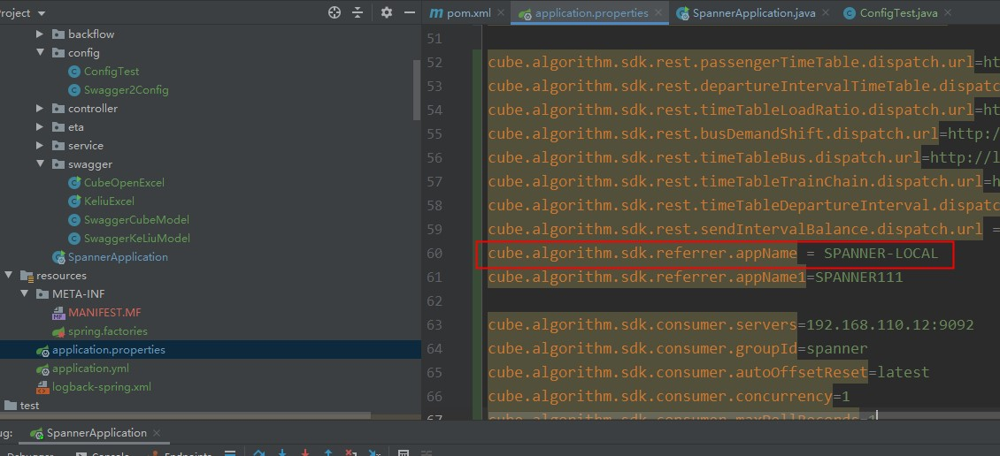

#1、为什么要用这个插件？
>- 为了能方便的使用apollo的公共namespace。
>- 将公共的配置抽取出来，简化各自应用程序重复的配置

apollo官方文档给的使用公共namespace的方法为：  
请查看官方文档[公共namespace接入步骤部分](https://github.com/ctripcorp/apollo/wiki/Apollo使用指南#二公共组件接入指南)

简单来说，如果要接入公共namespace需要以下几个步骤：
>1. 创建公共的namespace
>2. 在自己的应用中关联创建的公共namespace
>3. 在自己的应用代码中增加公共的namespace

  
需要按照上述这样配置才能在自己的代码中加载到关联的公共namespace配置。  

我们可以看到在关联的namespace配置中有DEPT2这一前缀这是apollo在用户创建配置时指定的部门标识。如下图(开发环境)所示：  
  

但是这个配置在开发、测试、生产并不一定是一样的。比如在我们的开发环境和测试环境就是不一样，我猜测生产环境也是不一样的。如下图就是测试环境的。  
  

可以看到开发环境和测试环境是不一样的。  
这样的话就会出现一个问题，那就是当你部署到不同的环境的时候，都需要在部署前修改自己代码中第一个图中那个位置上的代码。
这是一个不切实际的做法。  

那么如果想要在部署前不改变代码的情况下实现关联namespace，目前我知道的有两种：  
>1. 使用apollo提供的方式，要求测试环境，开发环境，生产环境的部门标识一样。
>2. 按照我这篇文章介绍的方式进行。  

下面让我来介绍下我这种方式的使用方式。

#2、如何使用此工具？

使用方式非常简单，只需要引入下面的pom配置即可，不需要增加任何其他配置：
```text
<dependency>
    <groupId>com.ibuscloud.pubtrans</groupId>
    <artifactId>ibus-apollo-common-namespace</artifactId>
    <version>1.0.0-SNAPSHOT</version>
</dependency>
```  

功能：可以省略apollo提供的关联方式中自己应用中的代码配置，其可以自动加载你在apollo关联的公共namespace。  

###配置的优先级问题(即相同的配置谁会覆盖谁)：

首先我们将apollo分为3类：
>1. 本地即 application.yml文件中的配置。记为 local
>2. 自己应用对应的apollo配置，即自己应用app_id对用的配置。记为appId
>3. 关联的公共namespace配置。记为 common1,common2(这里有两个表示引用了两个公共namespace，这里只是为了验证同为公共namespace间的优先级)

现在这里说下结论：appId>common1>common2>local。其中common1和common2的的优先级与你在apollo中关联的顺序有关。

下面是对应的一些测试：  

####1、其中优先级最高的是自己应用的apollo配置，也就是说在上述三类中同时存在的配置，自己应用对应的配置会覆盖掉其他配置中的相同配置。  

比如我有个配置 appId为 SPANNER 其配置如下：  
  

其中其关联了两个公共的namespace配置，namespace的配置如下：  
  

本地的配置为：  


其中这四个配置中有一条相同的配置，即为红框标出的部分。

下面我们看下最终此配置加载的值到底是哪一份：  


可以看到最终加载的配置的自己应用在apollo中配置的配置。即appId对应的配置。

####2、当只有公共namespace和本地配置时，公共的namespace配置会覆盖本地的配置

下面我将appId中的上述相同的那条配置注释掉：  
  

此时应用最终加载的配置为关联的 TEST1.cube-algorithm-common2 配置：  


同时，如果你关联了多个公共的namespace，那么哪个namespace在前面，那么最终加载到的配置就是哪个的。
从上面的图，common1，common2最终加载的配置是common2的，因为common2的顺序在common1的前面。
此时如果common1在前面那么加载到的配置就是common1的。如下图：  
  

最终加载到的配置为 TEST1.cube-algorithm-common1 的配置：  
  

#3、总结
以上就是此工具的使用方式  
如果有任何疑问请联系 @奉孝